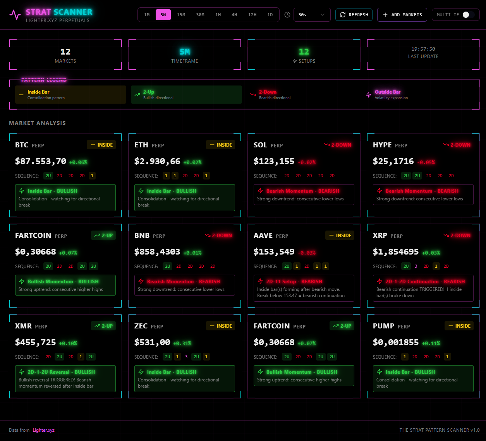
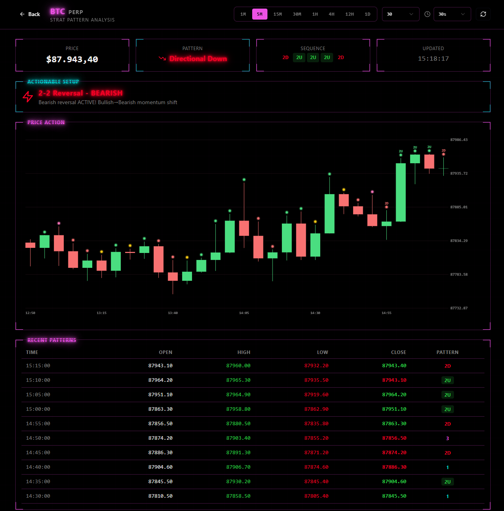
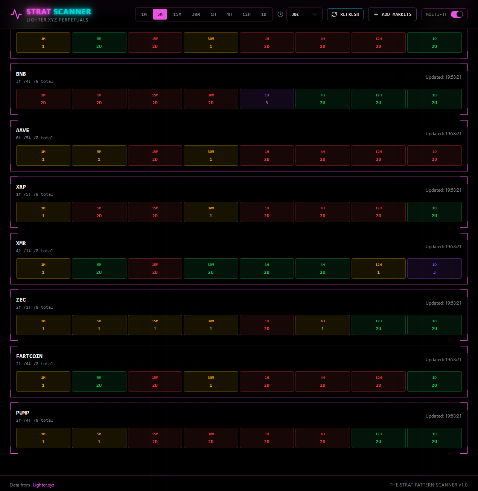

# Lighter Strat Analyzer

> Real-time cryptocurrency pattern scanner using "The Strat" trading methodology for Lighter.xyz perpetual futures markets.

[](https://lighter-strat-analyzer.vercel.app)
[](LICENSE)

## 🚀 Live Application

**[View Live Demo →](https://lighter-strat-analyzer.vercel.app)**

## ✨ Features

- **12 Markets:** BTC, ETH, SOL, HYPE, FARTCOIN, BNB, AAVE, XRP, XMR, ZEC, PUMP
- **Multiple Timeframes:** 1m, 5m, 15m, 30m, 1h, 4h, 12h, 1d
- **Full Timeframe Continuity (FTC):** Analyze all 8 timeframes simultaneously with confluence metrics
- **Real-Time Pattern Detection:** Inside Bar, Directional Up/Down, Outside Bar
- **Predictive Signals:** Setup patterns and triggered breakouts
- **Interactive Charts:** Click any market for detailed candlestick analysis
- **Smart Caching:** Tiered caching (30s to 4h TTL) with rate limiting for optimal performance
- **Dark Cyberpunk UI:** Neon accents with smooth animations

## 🎯 The Strat Patterns

| Pattern | Color | Meaning |
|---------|-------|---------|
| **1** (Inside Bar) | 🟡 Yellow | Consolidation - potential breakout setup |
| **2U** (Directional Up) | 🟢 Green | Bullish directional movement |
| **2D** (Directional Down) | 🔴 Red | Bearish directional movement |
| **3** (Outside Bar) | 🟣 Purple | Volatility expansion |

## 🛠️ Tech Stack

**Frontend:**
- React 18 + TypeScript
- Vite
- tRPC v11 (type-safe API)
- Tailwind CSS
- Wouter (routing)

**Backend:**
- Node.js + Express
- tRPC v11
- TypeScript
- dotenv (environment configuration)
- Lighter.xyz API integration

## 📦 Project Structure

```
lighter-strat-analyzer/
├── client/              # Frontend (Vite + React)
│   ├── src/
│   │   ├── components/  # UI components
│   │   ├── pages/       # Home & Chart pages
│   │   └── lib/         # tRPC client
│   └── package.json
├── server/              # Backend (Express + tRPC)
│   ├── lib/             # API clients, analyzers, FTC service
│   ├── routers/         # tRPC routers
│   ├── __tests__/       # Unit tests
│   └── index.ts
├── shared/              # Shared types & constants
│   ├── types.ts         # ⭐ Edit here to add/remove markets
│   └── const.ts         # Feature flags
└── package.json
```

## 🚀 Local Development

### Prerequisites
- Node.js 18+ 
- npm or pnpm

### Setup

```bash
# Clone repository
git clone https://github.com/higherorderbit69/lighter-strat-analyzer.git
cd lighter-strat-analyzer

# Install dependencies
npm install
cd client && npm install && cd ..

# Create .env file (optional - for FTC feature)
echo "FTC_ENABLED=true" > .env

# Start development servers
npm run dev
```

Open http://localhost:5173

### Environment Variables

Create a `.env` file in the project root to enable optional features:

```bash
# Enable Full Timeframe Continuity (FTC) feature
FTC_ENABLED=true
```

**Note:** FTC is disabled by default. When enabled, it analyzes all 8 timeframes simultaneously with intelligent caching and rate limiting (max 5 concurrent API requests).

## 🎨 Customizing Markets

Edit `shared/types.ts`:

```typescript
export const DEFAULT_MARKETS: Market[] = [
  { symbol: "BTC", marketIndex: 0, marketId: 1 },
  { symbol: "ETH", marketIndex: 1, marketId: 0 },
  // Add more markets here...
];
```

**Get Market IDs from Lighter API:**
```bash
curl https://mainnet.zklighter.elliot.ai/api/v1/orderBooks
```

## 🧪 Testing

```bash
# Run FTC unit tests
npx tsx server/__tests__/ftc.test.ts

# Type check
npx tsc --noEmit
```

## 🌐 Deployment

See [DEPLOYMENT.md](DEPLOYMENT.md) for complete deployment guide.

**Quick Deploy:**
- **Frontend:** Vercel (auto-deploy on push)
- **Backend:** Render (auto-deploy on push)
- **Environment:** Set `FTC_ENABLED=true` in production if desired

## 📸 Screenshots

### Dashboard (Standard View)


### Chart Detail


### Dashboard (FTC Multi-Timeframe View)


## 📝 License

MIT License - see [LICENSE](LICENSE) file

## 🙏 Acknowledgments

- **The Strat** methodology by Rob Smith
- **Lighter.xyz** for providing public API access
- **Manus** for UI inspiration

## 🤝 Contributing

Contributions welcome! Please open an issue or PR.

## 📧 Contact

Created by [@higherorderbit69](https://github.com/higherorderbit69)

---

**⭐ Star this repo if you find it useful!**
