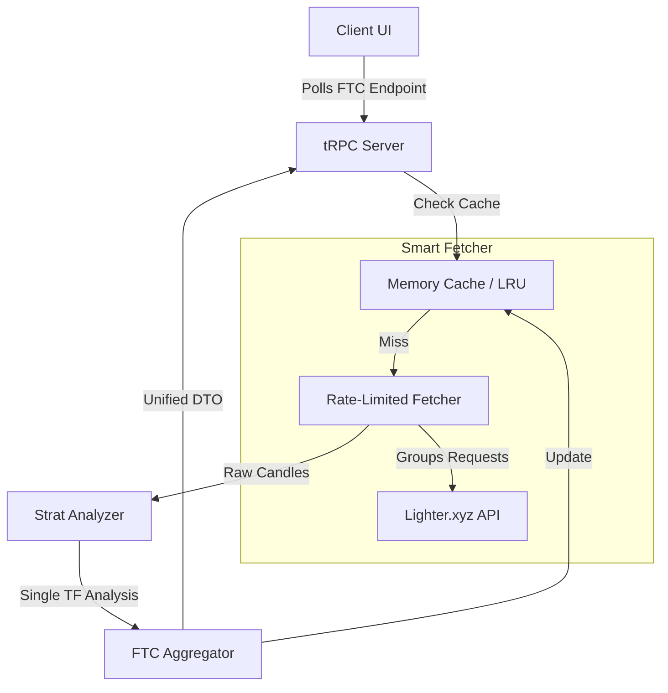

# FTC Design Specification

## 1. Critique of Manus’ Plan

**Strengths:**
*   **Concept:** The "strongest signal" logic (bullish vs bearish count) is a good starting heuristic for Strat confluence.
*   **Completeness:** Covers the standard Strat timeframe spectrum (1m to 1w).

**Weaknesses & Risks:**
*   **Naive Parallel Fetching (Critical):** `Promise.all(allTimeframes.map(...))` triggers 9 simultaneous API calls *per market*. For 10 markets, that's 90 concurrent requests. This guarantees rate-limit violations and IP bans on strict APIs.
*   **Missing Caching:** High timeframes (1w, 1d, 12h) change extremely slowly. Re-fetching them every cycle alongside 1m candles is wasteful.
*   **Analysis Location:** Doing meaningful multi-timeframe aggregation might be heavy if expanded in the future. It’s better orchestrated closer to the data source (server) to keep the client light and prevent "waterfall" fetching logic in UI components.
*   **Data Consistency:** Separate fetches can lead to "skewed" snapshots where the 1m candle is from T=100 and the 15m candle is from T=99 (network latency/race conditions), potentially showing invalid confluence states (e.g., 1m is part of a different session than 5m).

## 2. Architecture Overview

**Pattern:** Server-Side Aggregation with Tiered Caching.



**Data Flow:**
1.  **Request:** Client requests `analyzeFTC(markets: string[])`.
2.  **Tiered Fetch:**
    *   **Fast TFs (1m, 5m, 15m):** Fetched frequently (short TTL).
    *   **Slow TFs (1h, 4h... 1w):** Fetched infrequently or aggressively cached (long TTL).
3.  **Analysis:** `StratAnalyzer` classifies patterns for each timeframe independently.
4.  **Aggregation:** `FTC Aggregator` combines these analyses into a single Confluence Object.
5.  **Response:** User receives a single `MultiTimeframeAnalysis` object per market.

## 3. Data Model (Canonical)

```typescript
// Shared Types

export interface StratAnalysis {
    pattern: string;         // "2-2 Continuation"
    direction: "bullish" | "bearish" | "neutral";
    confidence: "high" | "medium" | "low";
    patternType: "1" | "2U" | "2D" | "3"; // Raw type of current candle
}

export interface MarketConfluence {
    bullishTimeframes: string[]; // e.g., ["1h", "4h"]
    bearishTimeframes: string[]; // e.g., ["5m"]
    score: number;               // 0-100 (bullish dominance)
    label: "Strong Buy" | "Buy" | "Neutral" | "Sell" | "Strong Sell";
}

export interface MultiTimeframeAnalysis {
    marketId: number;
    symbol: string;
    // Map of timeframe -> Analysis
    timeframes: Record<string, StratAnalysis>;
    confluence: MarketConfluence;
    lastUpdated: number;
}

export type FTCResponse = MultiTimeframeAnalysis[];
```

## 4. Data Strategy Decision

**Decision:** **Fetch Native Candles per Timeframe (with Aggressive Caching)**

**Justification:**
*   **History Requirements:** Valid Strat analysis depends on "Previous Candle" context (to define Inside vs Outside, 2U vs 2D). To classify a **1 Week** pattern, we need at least 2-3 weeks of data.
*   **Derivation Infeasibility:** Deriving a 1-week candle from 1-minute data requires fetching ~10,080 1m candles. Doing this for 10 markets is ~100k candles per cycle. This is far heavier on payload/bandwidth than making 9 small requests.
*   **Correctness:** Exchange "Daily Close" times can vary. Constructing 1D/1W candles manually introduces timezone risk and logic drift from the canonical exchange data.

**Tradeoffs:**
*   **Pros:** Data correctness, manageable payload sizes, leverages API's optimized aggregation.
*   **Cons:** Higher request count (mitigated by caching high TFs).

## 5. Candle Alignment Rules

1.  **In-Progress Candles:**
    *   We ALWAYS analyze the **In-Progress (open)** candle for the "Current Signal".
    *   Why: The Strat is predictive. A "2U" is a 2U *right now* if it broke the high. We don't wait for close to signal "Active".
2.  **Snapshot Consistency:**
    *   Accept loose consistency between TFs. It is acceptable if the 1m candle is 500ms newer than the 1w candle fetch.
    *   Strict timestamp alignment is not enforced across 9 independent fetches, but fetches should happen in a `Promise.all` (batched) to minimize drift.

## 6. Caching & Refresh Strategy

**Cache Keys:** `marketId:timeframe` (e.g., `1001:1h`)

**TTL Strategy (Smart Caching):**
*   `1m`:  TTL 30s (Live-ish)
*   `5m`:  TTL 2m
*   `15m`: TTL 5m
*   `1h`:  TTL 15m
*   `4h`:  TTL 30m
*   `1d`:  TTL 4h
*   `1w`:  TTL 12h

**Concurrency Limits:**
*   Implement a **Queue/Limiter** wrapper around `lighterApi`.
*   Max concurrent outgoing requests: **5**.
*   This prevents handling 10 markets (90 requests) from nuking the socket pool. Requests beyond 5 queue up.

**Incremental Updates:**
*   The system always returns the *cached* version if valid.
*   Background revalidation for expired keys (Stale-While-Revalidate pattern recommended if possible, or simple TTL hard expiry for MVP).

## 7. UI Integration Plan

**Location:** New "Matrix View" or "Scanner Mode".

**Grid Logic:**
*   Rows: Markets (BTC, ETH, SOL).
*   Columns: Timeframes (1m ... 1w) + Confluence Summary.

**Cell States:**
*   **Bullish (Green):** 2U, 2-2 Bullish.
*   **Bearish (Red):** 2D, 2-2 Bearish.
*   **Inside (Yellow):** 1.
*   **Outside (Purple):** 3.
*   **Loading:** Skeleton pulse.
*   **Stale:** Dimmed opacity if `lastUpdated` > 1 min ago.

## 8. Export Strategy

**Primary Format:** JSON (matches DTO).

**Canonical Export DTO:**
```json
{
  "timestamp": "2024-05-20T10:00:00Z",
  "markets": [
    {
      "symbol": "BTC-PERP",
      "score": 85,
      "setups": ["1h:2U", "4h:2U", "1d:Inside"]
    }
  ]
}
```

**Manus' Format Mapping:**
*   Manus proposed detailed object dump. We will simplify for export to just "Symbol + Score + Key Setups" to make it readable for external parsers.
*   **CSV View:** Flattened table. Columns: `Symbol, Score, 1m, 5m, 15m...`

## 9. Risks & Edge Cases

*   **Risk:** Lighter API rate limit is hit immediately on page load.
    *   *Mitigation:* The backend MUST queue requests. Do not fire 90 requests instantly.
*   **Risk:** `fetchCandles` fails for one specific TF (e.g., 1w data missing).
    *   *Mitigation:* `Partial Failure` tolerance. The FTC object returns "N/A" for that TF but computes confluence based on available TFs.
*   **Edge Case:** New token listings (no 1w data).
    *   *Handling:* Gracefully handle empty arrays from API.

## 10. Implementation Roadmap

**Step 1: Core Analysis Refactor**
*   Refactor `analyzeCandles` to be pure and reusable (done).
*   Create `MultiTimeframeAnalysis` interface in shared types.

**Step 2: Server-Side Aggregation**
*   Create `FTCService` class.
*   Implement `fetchAndAnalyze(market, tfs[])` with `Promise.all`.
*   **Crucial:** Add a simple in-memory `Map<cacheKey, {data, expiry}>` to cache higher TFs.

**Step 3: New tRPC Endpoint**
*   Add `strat.getFTCMatrix({ markets: [] })` procedure.
*   Wire up to `FTCService`.

**Step 4: UI Implementation**
*   Create `FTCMatrix` component.
*   Add toggle `FTC_ENABLED` in `Home.tsx`.
*   Render grid when enabled.

**Step 5: Export Feature**

## 11. UI Component Architecture (Mockup Derived)

Based on `docs/ftc-ui-mockups/`, the UI follows a "Dashboard of Cards" layout.

### Visual Hierarchy
1.  **Global Header:** "STRAT SCANNER" with View Toggle (Single TF vs Multi TF) and Controls.
2.  **Grid:** Responsive grid of **Market Cards**.
3.  **Market Card Structure:**
    *   **Top:** Symbol + Current Price + **Confluence Badge** (e.g., "7/9 BULLISH").
    *   **Middle (Core):** **3x3 Timeframe Matrix** (1m-1w).
        *   Each cell shows: TF Label (small) + Pattern (large, distinct color).
    *   **Lower Middle:** **Signal Strength Meter** (Bar chart 0-100%).
    *   **Bottom:** **Actionable Signal** (e.g., "Strong Bullish - 8 TF Confluence" or "Caution - Mixed").

### React Component Map

```tsx
// 1. Main View Container
<FTCDashboard>
  <FTCHeader />
  <FTCGrid>
    {markets.map(market => (
      <FTCMarketCard key={market.id} data={market} />
    ))}
  </FTCGrid>
</FTCDashboard>

// 2. The Card Component
<FTCMarketCard>
  <CardHeader>
    <SymbolDisplay />
    <ConfluenceBadge score={data.confluence.score} label={data.confluence.label} />
  </CardHeader>
  
  <TimeframeMatrix>
    {/* 3x3 Grid */}
    {TIMEFRAMES.map(tf => (
      <TimeframeCell 
        tf={tf} 
        pattern={data.timeframes[tf].patternType} 
        color={getPatternColor(pattern)} // Green(2U)/Red(2D)/Cyan(1)/Purple(3)
      />
    ))}
  </TimeframeMatrix>
  
  <SignalStrengthMeter value={data.confluence.score} />
  
  <ConfluenceFooter status={data.confluence.label} />
</FTCMarketCard>
```

### Styling Requirements (from Mockups)
*   **Matrix:** 3 col x 3 row grid. Borders between cells.
*   **Colors:** High contrast neon.
    *   2U: Green
    *   2D: Red
    *   1: Cyan/Blue (Inside)
    *   3: Purple (Outside)
*   **Typography:** Monospace for prices and patterns.
